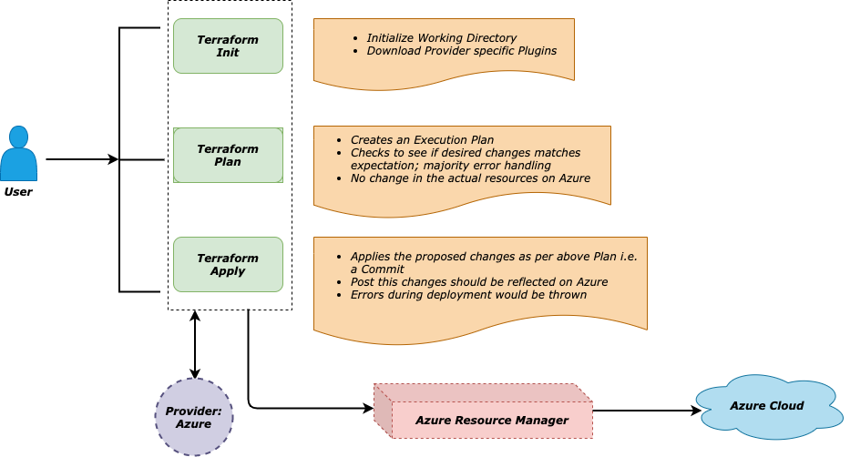

# Codify Infrastructure on Azure - terraform

Let us see how to deploy a **Storage** resource on Azure. <br>But before delving into this, let us have a look at the high level view of the terraform components:



## Storage

### Providers

```
provider "azurerm" {

    version = "=2.11.0"
    features {}
    subscription_id = "<subscription_id>"
    tenant_id = "<tenant_id>"

}
```

This sets teh Azure Provider version and other details like subsrion_id and tenant_id

*terrqform init* command will act uppn thsi first qnd downalods the necessary plugin of desired version and its dependencies.

form init* command will act uppn thsi first qnd downalods the necessary plugin of desired version and its dependencies.

### Resource Group

```
resource "azurerm_resource_group" "rg" {

    name = "terraform-workshop-rg"
    location = "eastus"
    tags = { // (Optional)

        Primary_Owner = "<email_id>"
        Purpose = "workshop"

    }
}
```

*azurerm_resource_group* is the resource Type and *rg* is the name of the resource in terraform context i.e. the name by which terraform internally refers to it. This also brings a degree of object orientation or structured approach while accessing the resource and its properties e.g. *azurerm_resource_group.rg.localtion*

### Storage Account

```
resource "azurerm_storage_account" "storage" {

    name = "terrwkshpstg"    
    resource_group_name = azurerm_resource_group.rg.name // Ref1
    location = azurerm_resource_group.rg.location // Ref2
    account_kind = "StorageV2"
    account_tier = "Premium"
    access_tier = "Hot"
    account_replication_type = "LRS"
}
```

This is quite self-explanatory so won't spend much time on this! Note the *Ref1* and *Ref2* comments - these are values coming from previous block of *azurerm_resource_group*

### Steps

- terraform init
- terraform plan -out="storage-plan"
- terraform apply "storage-plan"

So, that is it...with the simple steps you have your first Storage account using terraform is deployed and ready to be used! <br>Now obviously there are plenty of more parameters...to configure a Storage account creation; please refer here: https://www.terraform.io/docs/providers/azurerm/r/storage_account.html 

### Modules and Dependencies

As usual, as we completed the first step, next endeavour is to make the Storage resource more secured - either using IP Restrictions Or integrating with a Virtual Network (*aka Subnet of VNET*) through Service Endpoint.

So let us see how to achieve this in terraform...the trick is to use the concept of terraform Modules<br>Let us create a Azure VNET first with corresponding Subnet to be integrated with the above Storage resource.<br>This would ensure that all communication that Storage resource would be accessed only from within the mapped Subnet i.e. resources which sits within that Subnet or themselves integrated with that Subnet. On Azure this is achieved using Service Endpoint - which is secured endpoint created for a particular type of Resource - Microsoft.Storage in this case.

Terraform makes this entire mapping process very automated in a very simple way; let us see that in action:

```
resource "azurerm_virtual_network" "vnet" {

    name = "terraform-workshop-vnet"
    location = azurerm_resource_group.rg.location
    resource_group_name = azurerm_resource_group.rg.name
    address_space = ["173.0.0.0/16"]    
  
}
```

This will snippet will ensure the creation of the virtual network on Azure with the address space - *173.0.0.0/16*

```
resource "azurerm_subnet" "storage-subnet" {

    name = "terraform-workshop-storage-subnet"    
    resource_group_name = azurerm_resource_group.rg.name
    virtual_network_name = azurerm_virtual_network.vnet.name
    address_prefixes = ["173.0.0.0/24"]
    service_endpoints = ["Microsoft.Storage"] // extremely important
  
}
```

```
output "storage-subnet-id" {    // extremely important
  value = azurerm_subnet.storage-subnet.id
}
```

The line - ***service_endpoints = ["Microsoft.Storage"]*** is responsible for creating the Service Endpoint for any Storage resource.<br Similarly, the *output* section ensure the subnet id is exposed for use by the other config modules i.e. Storage module in thsi case!

Then in the Storage config file -

```
resource "azurerm_storage_account" "storage" {

    name = "terrwkshpstg"    
    resource_group_name = azurerm_resource_group.rg.name
    location = azurerm_resource_group.rg.location
    account_kind = "StorageV2"
    account_tier = "Premium"
    access_tier = "Hot"
    account_replication_type = "LRS"

    network_rules {

        default_action = "Deny"
        virtual_network_subnet_ids = ["module.network.storage-subnet-id"]
        bypass = ["Metrics"]

    }
  
}
```

***network_rules*** is the key where the Storage is mapped with he above Subnet having exposed a *Service Endpoint*.This ensure that all communication between the resources own the above subnet and the Storage is over Microsoft Backbone network.<br>Only thing that still remains a mystery is the *virtual_network_subnet_ids = ["**module.network.storage-subnet-id**"]*

How is this thing being mapped? Very simple -

```
module "network" {
  source = "../Network/"
  
}
```

With this at the top of the storage config file - ensures that the module is referred and the objects that are output from that module can be referred!

This is how, with the help of terraform config, an automated deployment of  Storage onto Azure can happen, integrated with Network rules

#### Refs:

- **Storage Accoun**t - https://www.terraform.io/docs/providers/azurerm/r/storage_account.html

- **Storage with Network Rules** - https://www.terraform.io/docs/providers/azurerm/r/storage_account_network_rules.html

- **Terraform Modules** - https://www.terraform.io/docs/configuration/modules.html

- **Source Code**: https://github.com/monojit18/TerraformProjects.git

  

## ACR

```
resource "azurerm_container_registry" "acr" {

    name = "trwkshpacr"
    location = azurerm_resource_group.rg.location
    resource_group_name = azurerm_resource_group.rg.name
    sku = "Premium"
    admin_enabled = "false"
    network_rule_set {

        default_action = "Deny"
        ip_rule {

            action = "Allow"
            ip_range = module.network.acr-subnet-ip
        }
    }
}
```

The type of the resource is *azurerm_container_registry* and terraform specific name of the resource is *acr*.

Most of the parameters are self-explanatory but few needs some explanation -

***admin_enabled*** - This ensures that you do not allow everyone to access ACR; this is first level of defence. So, it is forced that a *Service Principal* is created and used that a s reds for accessing the ACR

***network_rule_set*** - This is 2nd line of defence; making sure that the individual or process/script can access ACR only from designated network - this can be a VM or another process/program/service running in that subnet.

*Note: The newest offering is Private Endpoint support for ACR where a Private IP range is- WIP*

###  Module Dependencies

```
module "network" {
  source = "../Network/"
  
}
```

This ensures that the SubnetId poured out by Network module can be referred by the ACR resource

On the other hand, in the Network module -

```
output "acr-subnet-ip" {    
  value = azurerm_subnet.acr-subnet.address_prefixes[0]
}
```

This is responsible to output the subnet id for ACR

#### Refs:

- **ACR** - https://www.terraform.io/docs/providers/azurerm/r/container_registry.html

- **ACR with Network Rules** - https://www.terraform.io/docs/providers/azurerm/r/container_registry.html#network_rule_set

- **Source Code**: https://github.com/monojit18/TerraformProjects.git 

  
## KeyVault

```
resource "azurerm_key_vault" "kv" {

    name = "terraform-workshop-kv"
    location = azurerm_resource_group.rg.location
    resource_group_name = azurerm_resource_group.rg.name
    tenant_id = "<tenant_id>"
    enabled_for_disk_encryption = true
    enabled_for_template_deployment = true
    sku_name = "premium"
    
}
```

All parameters are self-explanatory here in this case and quite straight-forward. This is primarily creating a *KeyVault* resource on Azure.

```
resource "azurerm_key_vault_access_policy" "kvpolicy" {
  
    key_vault_id = azurerm_key_vault.kv.id
    tenant_id = "<tenant_id>"
    object_id = "<object_id>"
    secret_permissions = [
        "get", "list", "delete", "set"
    ]

}
```

This is to define KeyVault access policy

Now KeyVault being the most critical resource on Azure, it is of utmost importance that maximum security is maintained in terms of accessing the KeyVault resource!

The process is same as ACR or Storage scenarios - either use VNET integration, IP Ranges OR the newest offering is to use Private Endpoint. Te last option us not discussed here and terraform, most probably, does not have that option yet. So, you might beed to do it manually in portal if you want go ahead with Private Endpoint approach. Rest two are quite possible -

```
resource "azurerm_key_vault" "kv" {

    name = "terraform-workshop-kv"
    location = azurerm_resource_group.rg.location
    resource_group_name = azurerm_resource_group.rg.name
    tenant_id = "<tenant_id>"
    enabled_for_disk_encryption = true
    enabled_for_template_deployment = true
    sku_name = "premium"
    
    network_acls {

        bypass = "AzureServices"
        default_action = "Deny"
        virtual_network_subnet_ids = ["module.network.kv-subnet-id"]

    } 
}
```

As can be seen  ***network_acls*** is the key - this links to the id of the subnet resource created by Network module; same as it was done for Storage and ACR above!

Let us see the network module section -

```
output "kv-subnet-id" {    
  value = azurerm_subnet.kv-subnet.id
}
```

#### Refs:

- **KeyVault** - https://www.terraform.io/docs/providers/azurerm/r/key_vault.html
- **KeyVault with Access Policies** - https://www.terraform.io/docs/providers/azurerm/r/key_vault_access_policy.html
- **KeyVault with Network Rules** - https://www.terraform.io/docs/providers/azurerm/r/key_vault.html#network_acls
- **Source Code**: https://github.com/monojit18/TerraformProjects.git 